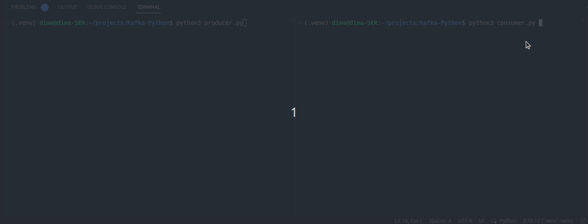

# Kafka-Python

## Project descriprion

This is a simple example of using Apache Kafka with Python. Producer produces messages with texts and consumer consumes it.



## Getting Started

Follow these steps to get the project up and running on your local machine:

**Download the latest Kafka release and extract it to Kafka folder**

**Start the ZooKeeper service:**
```bash
cd Kafka
bin/zookeeper-server-start.sh config/zookeeper.properties
```

**Start the Kafka broker service:**
```bash
bin/kafka-server-start.sh config/server.properties
```
Once all services have successfully launched, you will have a basic Kafka environment running and ready to use.


**Clone the Repository:**
```bash
git https://github.com/DmitryDubovikov/Kafka-Python.git
cd Kafka-Python
```

**Create a Virtual Environment:**
```bash
python3 -m venv venv
source venv/bin/activate  # On Windows: venv\Scripts\activate
```

**Install Dependencies:**
```bash
pip install -r requirements.txt
```

**Run consumer.py and producer.py in two terminals:**
```bash
python3 consumer.py
```

```bash
python3 producer.py
```